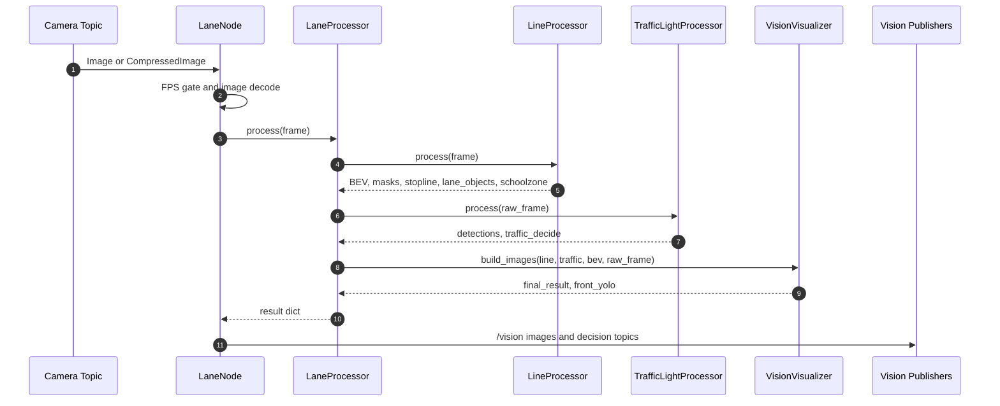
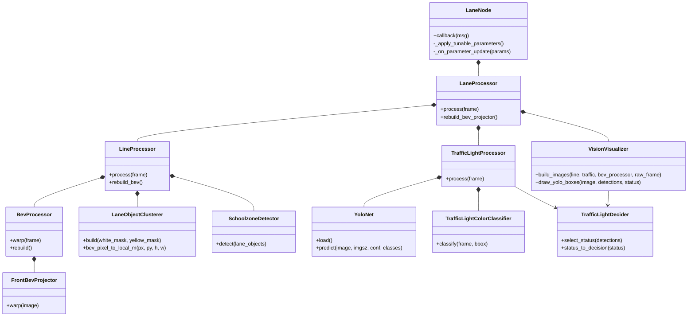

# vision_pkg_ros2

- **구현 방식:** ROS 2·OpenCV 기반 BEV 영상처리와 YOLO11n·신호등 ROI 색상 분류를 결합해 전방 카메라 인지 파이프라인을 구성했습니다.
- **수행 기능:** 차선·노면 표시를 차량 좌표계 객체로 변환하고, 정지선 거리·어린이 보호구역·신호 상태를 판단 모듈용 ROS 2 토픽으로 제공합니다.
- **설계 특징:** 차선 처리·신호등 인식·시각화를 분리하고, 런타임 파라미터 조정과 디버그 영상·데이터셋 캡처 도구로 튜닝과 데이터 수집을 지원합니다.

Team-Stier 국민대학교 자율주행 프로젝트를 위한 ROS 2 비전 패키지입니다.

이 패키지는 현재 로컬에서 사용 중인 최신 비전 코드를 ROS 2 패키지 형태로 정리한 것입니다.

- 전방 카메라 기반 차선 검출
- 전방 카메라 BEV(Bird's-Eye View) 변환
- 정지선 검출
- 노란색 BEV 클러스터 기반 스쿨존 검출
- 회색 아스팔트와 구분되는 가장 큰 내부 검정 영역을 직사각형으로 덮어 출발 체크무늬의 장애물 클러스터 제외
- 다항식 차선 피팅 없이, 차선/노면 표시를 객체 박스 형태로 출력
- `models/` 안의 파인튜닝된 모델을 사용하는 YOLO11n 신호등 검출
- 튜닝 및 데모용 디버그 이미지 퍼블리시
- 추후 신호등 데이터 수집을 위한 데이터셋 캡처 유틸리티

## 패키지 구조

```text
vision_pkg_ros2/
├── launch/
│   └── vision.launch.py
├── models/
│   └── traffic_light_yolo11n_best.pt
├── docs/
│   ├── source_code_diagrams.md
│   └── source_code_diagram_images/
└── vision_pkg_ros2/
    ├── lane_node.py
    ├── lane_processor.py
    ├── line_processor.py
    ├── bev.py
    ├── front_bev_projector.py
    ├── lane_object_clusterer.py
    ├── schoolzone_detector.py
    ├── traffic_light_processor.py
    ├── traffic_light_crop.py
    ├── traffic_light_yolo.py
    ├── traffic_light_classifier.py
    ├── traffic_light_decider.py
    ├── visualization.py
    ├── traffic_light_yolo_viewer.py
    ├── traffic_light_dataset_capture.py
    ├── ros_message_utils.py
    ├── vision_utils.py
    └── config.py
```

소스 코드 기준 시퀀스 다이어그램과 클래스 다이어그램은
[`docs/source_code_diagrams.md`](docs/source_code_diagrams.md)에 정리되어 있습니다.
PNG 이미지 파일은 [`docs/source_code_diagram_images/`](docs/source_code_diagram_images/)에 있습니다.

## 주요 노드

`lane_node`

- 전방 카메라 이미지를 구독합니다.
- 차선 마스크, BEV 이미지, 최종 디버그 이미지, 차선 객체, 그리고 의미 기반 bool/int 판단값을 퍼블리시합니다.
- 차선/노면 표시를 `/vision_objs` 토픽에 장애물 박스 형태로 퍼블리시합니다.
- `yolo_model_path`가 따로 지정되지 않으면 패키지 기본 YOLO 신호등 모델을 사용합니다.

`traffic_light_yolo_viewer`

- 카메라 토픽에서 파인튜닝된 YOLO 모델을 빠르게 확인하기 위한 경량 신호등 뷰어입니다.
- 신호등 검출 결과와 추정 신호 상태를 화면에 그립니다.

`traffic_light_dataset_capture`

- 카메라 프레임을 YOLO 데이터셋 구조로 저장합니다.
- 빈 라벨 파일과 `data.yaml` 기본 구조를 생성합니다.

## 소스 코드 다이어그램

아래 다이어그램은 `vision_pkg_ros2` 내부 코드만 기준으로 한 요약입니다.
더 자세한 시퀀스와 보조 도구 클래스는
[`docs/source_code_diagrams.md`](docs/source_code_diagrams.md)를 참고합니다.





## Conventions

### Naming

이름만으로 역할을 유추할 수 있게 작성합니다.

| 대상 | 규칙 | 예시 |
| --- | --- | --- |
| class, struct | 첫 글자 대문자, 단어 구분 시 대문자 | `LaneNode`, `TrafficLightProcessor` |
| function | 첫 단어 소문자, 이후 단어 첫 글자 대문자. 동사로 시작 | `processFrame`, `detectStopLine` |
| Python function | 기존 Python 코드 스타일에 맞춰 `snake_case` 사용 | `detect_stop_line`, `create_lane_objects_msg` |
| parameters | 소문자, 단어 사이에 `_` 삽입 | `image_topic`, `lane_objects` |
| ROS node name | 기존 실행 이름 유지 | `lane_node` |
| ROS topic | 기존 인터페이스 이름 유지 | `/vision_objs`, `/vision/front_yolo` |

### Operator

연산자 앞뒤에는 공백을 둡니다.

```text
good: result = left + right
bad:  result=left+right
```

### Indentation

Python은 PEP 8 기준 4칸 들여쓰기를 따릅니다. Python이 아닌 파일에서는 각 줄의 중첩 레벨이 일정하게 보이도록 맞춥니다.

### Endl

논리적으로 하나의 블록이 끝나면 한 줄을 띄워 다음 블록과 구분합니다. 관련 없는 처리 흐름을 붙여 쓰지 않습니다.

### Comment

함수 주석은 필요한 경우에만 아래 정보를 간결하게 적습니다.

```text
Function
- 함수이름
- 기능
- 인자
- 반환값
```

복잡한 블록에는 한 줄 요약을 둡니다. 한 문장만으로 충분한 코드는 문장 주석을 과하게 추가하지 않습니다.

### Interfaces

노드 간 communication은 README의 구독 토픽, 퍼블리시 토픽 표에 명시합니다. `lane_node` 기준 인터페이스는 다음과 같습니다.

| 구분 | 토픽 | 타입 |
| --- | --- | --- |
| Subscribe | `/usb_cam/image_raw/front` | `sensor_msgs/Image` |
| Publish | `/vision/lane_mask` | `sensor_msgs/Image` |
| Publish | `/vision/bev` | `sensor_msgs/Image` |
| Publish | `/vision/final_result` | `sensor_msgs/Image` |
| Publish | `/vision/front_yolo` | `sensor_msgs/Image` |
| Publish | `/vision_objs` | `interfaces/Objects` |
| Publish | `/schoolzone` | `std_msgs/Bool` |
| Publish | `/stoplane` | `std_msgs/Bool` |
| Publish | `/vision/stopline_distance` | `std_msgs/Float32` |
| Publish | `/trafficlight` | `std_msgs/Int32` |

### Sequence Diagram

구현한 코드는 Mermaid로 시퀀스 다이어그램과 클래스 다이어그램을 남깁니다.

- class 단위: 주요 클래스 관계는 `docs/source_code_diagrams.md`에 작성합니다.
- component 단위: 차선 처리, 신호등 처리처럼 기능 단위 시퀀스를 작성합니다.
- subsystem 단위: `lane_node` 입력부터 퍼블리시까지 전체 흐름을 작성합니다.
- Sub/Pub topic: 다이어그램 또는 README 인터페이스 표에 명시합니다.

### Branch

브랜치 이름은 작업 성격이 먼저 보이게 작성합니다.

| 분류 | 용도 |
| --- | --- |
| `Topic` | 토픽 이름, 메시지 연결, ROS interface 변경 |
| `Design` | 구조 설계, 다이어그램, 패키지 구조 정리 |
| `Perception` | 비전 인식 알고리즘, 카메라 처리, YOLO, BEV |
| `Precision` | 정확도 개선, 파라미터 튜닝, 임계값 조정 |
| `Control` | 제어 관련 변경 |
| `Docs` | README, 문서, 이미지, 다이어그램 |
| `Others` | 위 분류에 들어가지 않는 기타 작업 |

## 빌드

워크스페이스 루트에서 실행합니다.

```bash
cd ~/xycar_ws
pip install -r src/track_drive/vision_pkg_ros2/requirements.txt
colcon build --symlink-install \
  --base-paths src/track_drive/interfaces src/track_drive/vision_pkg_ros2 \
  --packages-up-to vision_pkg_ros2
source install/setup.bash
```

## 실행

기본 전방 카메라 토픽으로 실행:

```bash
ros2 launch vision_pkg_ros2 vision.launch.py
```

실행하면 `rqt_image_view`가 `/vision/front_yolo`를 열어 전방 원본 영상 위에
YOLO 검출 박스, 클래스, confidence, 신호 상태를 표시합니다.

다른 이미지 토픽 사용:

```bash
ros2 launch vision_pkg_ros2 vision.launch.py image_topic:=/usb_cam/image_raw/front
```

압축 이미지 토픽 사용:

```bash
ros2 launch vision_pkg_ros2 vision.launch.py image_topic:=/camera/image/compressed compressed:=true
```

다른 YOLO 모델 사용:

```bash
ros2 launch vision_pkg_ros2 vision.launch.py yolo_model_path:=/absolute/path/to/best.pt
```

## 퍼블리시 토픽

| 토픽 | 타입 | 목적 |
| --- | --- | --- |
| `/vision/lane_mask` | `sensor_msgs/Image` | 흰색/노란색 차선 이진 마스크 |
| `/vision/bev` | `sensor_msgs/Image` | 전방 카메라 BEV 이미지 |
| `/vision/final_result` | `sensor_msgs/Image` | 차선, 정지선, YOLO 및 어린이보호구역 상태를 포함한 최종 오버레이 |
| `/vision/front_yolo` | `sensor_msgs/Image` | 전방 원본 영상 위에 YOLO 박스, 클래스, confidence, 신호 및 어린이보호구역 상태를 표시한 디버그 영상 |
| `/vision_objs` | `interfaces/Objects` | 객체 박스 형태의 차선/노면 표시. 필드: `x`, `y`, `x_size`, `y_size`, `yaw`, `lable` |
| `/schoolzone` | `std_msgs/Bool` | 노란색 차선 클러스터가 20개 이상이면 `true` |
| `/stoplane` | `std_msgs/Bool` | 정지선이 검출되고 `/vision/stopline_distance`가 `stop_line_trigger_distance_m` 이하이면 `true` |
| `/vision/stopline_distance` | `std_msgs/Float32` | 차량에서 검출된 정지선의 가장 가까운 가장자리까지 거리(m). 미검출 시 `-1.0` |
| `/trafficlight` | `std_msgs/Int32` | `judgement_pkg` 기준 TrafficLight enum. `0=UNKNOWN/NONE`, `1=GREEN/GO`, `2=LEFT`, `3=RED/STOP/YELLOW` |

`/vision_objs`에서 `x`, `y`는 차량 로컬 좌표계 기준 미터 단위입니다. 객체는 기본적으로 전체 BEV 화면 범위를 대상으로 하며, 현재 전방 최대 `21.75 m`까지 포함합니다. `x_size` 기본값은 `1.30 m`, `y_size` 기본값은 `0.12 m`이고, `lable`은 차선 색상을 저장합니다. 흰색 차선은 `2`, 노란색 차선은 `3`입니다.

## 구독 토픽

| 토픽 | 타입 | 목적 |
| --- | --- | --- |
| `/usb_cam/image_raw/front` | `sensor_msgs/Image` | 기본 전방 카메라 이미지 |

## 모델

선택된 배포용 모델은 다음 파일입니다.

```text
models/traffic_light_yolo11n_best.pt
```

원본 학습 run 위치:

```text
~/xycar_ws/runs/sim_traffic_light_whole/final_whole_yolo11n/weights/best.pt
```

학습 데이터셋 위치:

```text
~/xycar_ws/datasets/sim_traffic_light_whole
```

이 패키지에는 선택된 모델과 학습 요약 파일만 포함합니다. 전체 데이터셋과 원본 학습 run 폴더는 팀에서 명시적으로 버전 관리하기로 결정한 경우가 아니라면 GitHub에 올리지 않는 것이 좋습니다.
