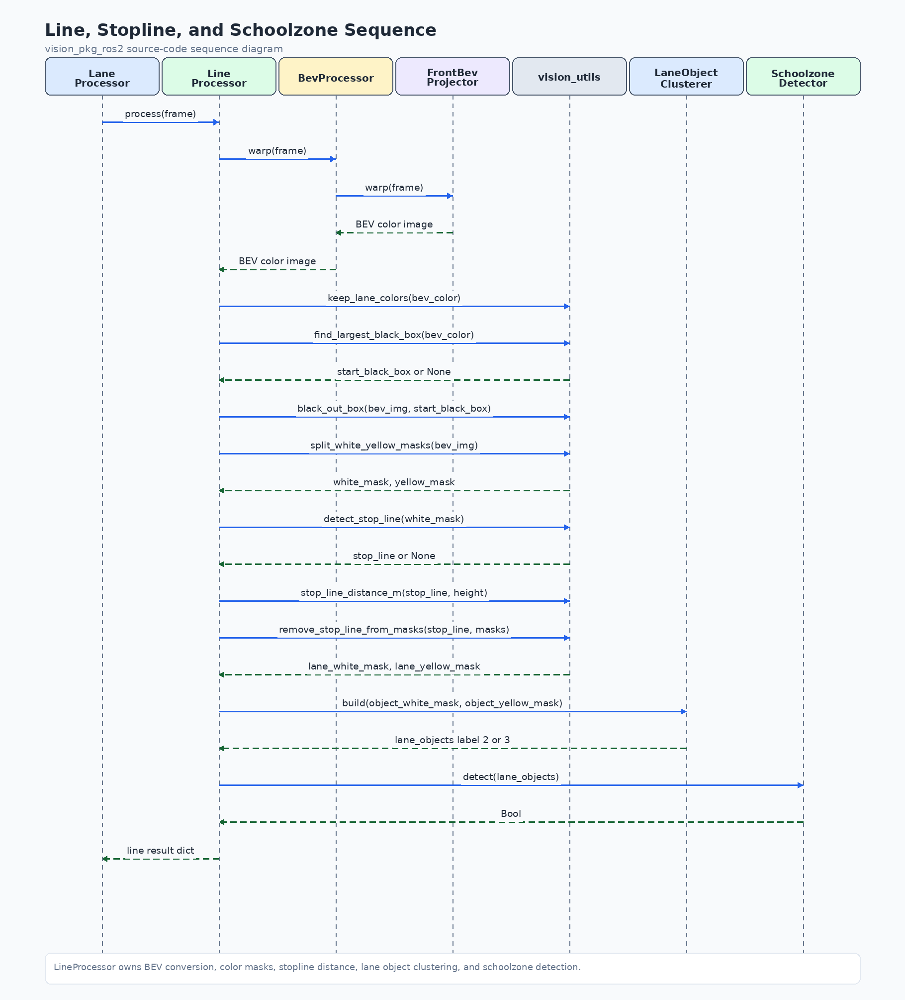

# vision_pkg_ros2

- **구현 방식:** ROS 2·OpenCV 기반 BEV 영상처리와 YOLO11n·신호등 ROI 색상 분류를 결합해 전방 카메라 인지 파이프라인을 구성했습니다.
- **수행 기능:** 차선·노면 표시를 차량 좌표계 객체로 변환하고, 정지선 거리·어린이 보호구역·신호 상태를 판단 모듈용 ROS 2 토픽으로 제공합니다.
- **설계 특징:** 차선 처리·신호등 인식·시각화를 분리하고, 런타임 파라미터 조정과 디버그 영상·데이터셋 캡처 도구로 튜닝과 데이터 수집을 지원합니다.

> **CV·자기소개용 PR 포트폴리오**입니다. 프로젝트에서 수행한 역할, 구현 방식과 문제 해결 경험을 소개합니다.

**국민대학교 자율주행 프로젝트 · ROS 2 Camera Perception**

차선·노면 표시와 신호등을 인식하고, 판단·경로 생성 모듈에 필요한 객체·상태 정보를 제공하는 비전 패키지를 개발했습니다. OpenCV 기반 BEV 처리와 파인튜닝된 YOLO11n 신호등 모델을 하나의 ROS 2 입력·출력 흐름으로 구성했습니다.

[나의 기여](#나의-기여) · [설계 선택](#설계-선택) · [설계 자료](#설계-자료) · [빌드·토픽·모델 안내](docs/IMPLEMENTATION.md)

## 나의 기여

| 작업 | 구현 방식 | 제공한 기능 |
| --- | --- | --- |
| 차선·노면 표시 인지 | OpenCV 색상 마스크·BEV·클러스터링 | 차량 로컬 좌표계의 차선/노면 객체 출력 |
| 정지선 판단 | 정지선 검출·미터 거리 계산·거리 임계값 | 정지선 거리와 정지 조건 토픽 발행 |
| 어린이 보호구역 | 노란색 BEV 객체 클러스터 수 기반 판단 | 보호구역 상태 토픽 발행 |
| 신호등 인지 | YOLO11n 검출·ROI 색상 분류·상태 판단 | 정지·직진·좌회전 신호 상태 제공 |
| 모듈 연결·튜닝 | ROS 2 토픽·런타임 파라미터·디버그 영상 | 판단 모듈 연동과 인지 결과 확인 |
| 데이터 수집 도구 | 카메라 프레임·YOLO 데이터셋 구조 저장 | 후속 라벨링을 위한 데이터셋 캡처 지원 |

## 설계 선택

- **경로 생성 모듈에 전달할 표현:** 차선을 다항식 경로로 피팅하는 대신 차선·노면 표시를 차량 좌표계 객체 박스로 제공합니다.
- **신호등 위치와 상태 분리:** YOLO로 검출한 영역에 색상 분류와 판단 로직을 연결해 최종 신호 상태를 생성합니다.
- **튜닝과 관찰 가능성:** BEV·마스크·YOLO 오버레이를 별도 출력하고 실행 중 파라미터를 조정하도록 구성했습니다.
- **데이터 수집과 라벨링 구분:** 캡처 도구는 영상과 빈 라벨 파일을 저장합니다. 자동 정답 라벨링이나 검출 정확도 평가 기능으로 소개하지 않습니다.

## 설계 자료

차선·정지선·보호구역 처리 시퀀스 보기

[신호등 처리 시퀀스](docs/source_code_diagram_images/traffic_light_sequence.png) · [클래스·전체 흐름 설명](docs/source_code_diagrams.md)

## 구현 근거와 기록

[ROS 2 노드](vision_pkg_ros2/lane_node.py) · [차선·정지선 처리](vision_pkg_ros2/line_processor.py) · [차량 좌표 객체 변환](vision_pkg_ros2/lane_object_clusterer.py) · [신호등 인지](vision_pkg_ros2/traffic_light_processor.py) · [기존 알고리즘 테스트](test/test_current_algorithms.py)

빌드·실행 방법, ROS 토픽 표, 배포 모델과 기존 개발 규칙은 [상세 구현 안내](docs/IMPLEMENTATION.md)에 보존했습니다. 이 포트폴리오 정리에서 모델 성능 평가나 ROS 2 주행을 새로 실행하지는 않았습니다.
