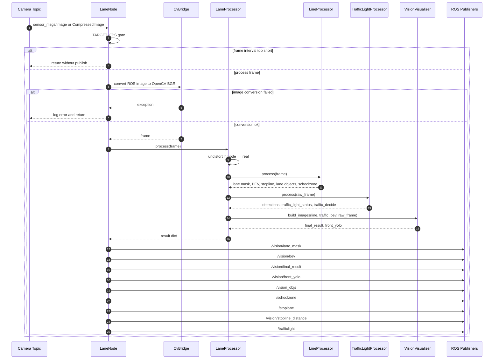
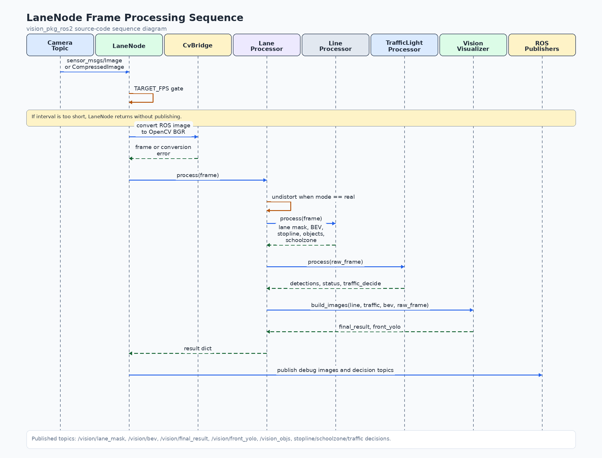
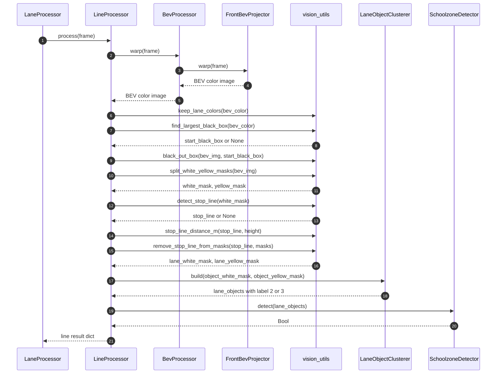
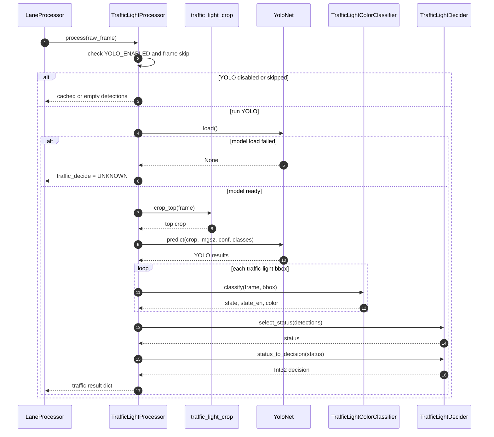
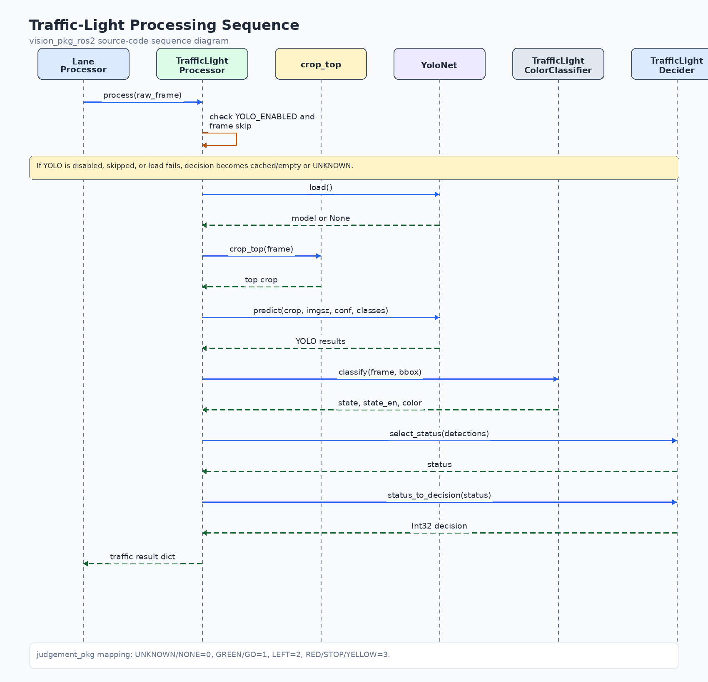
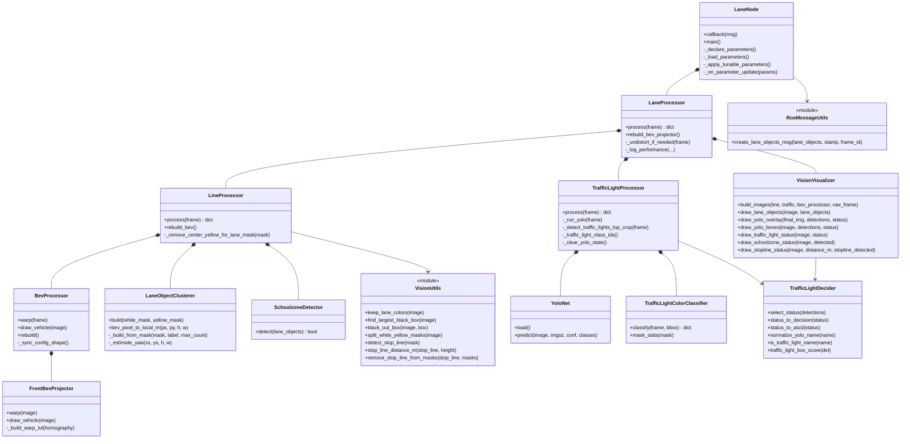
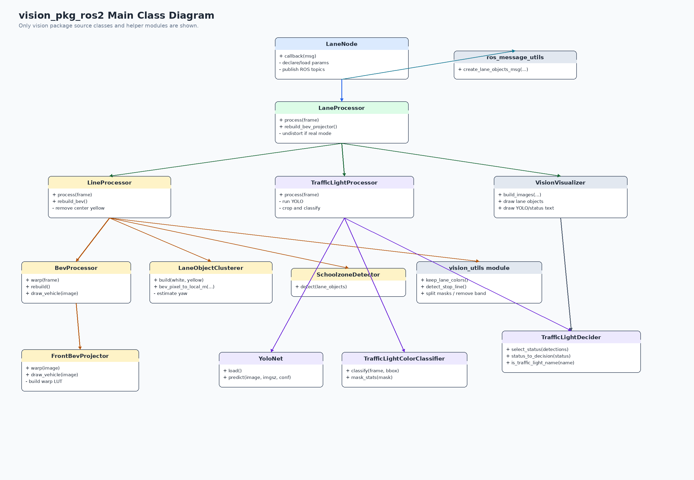
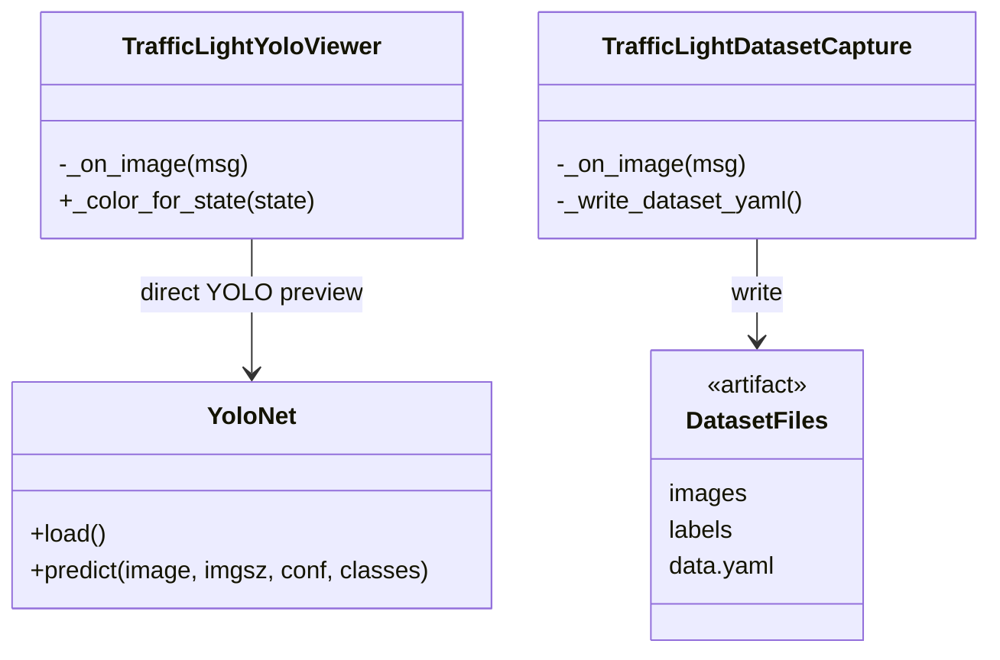
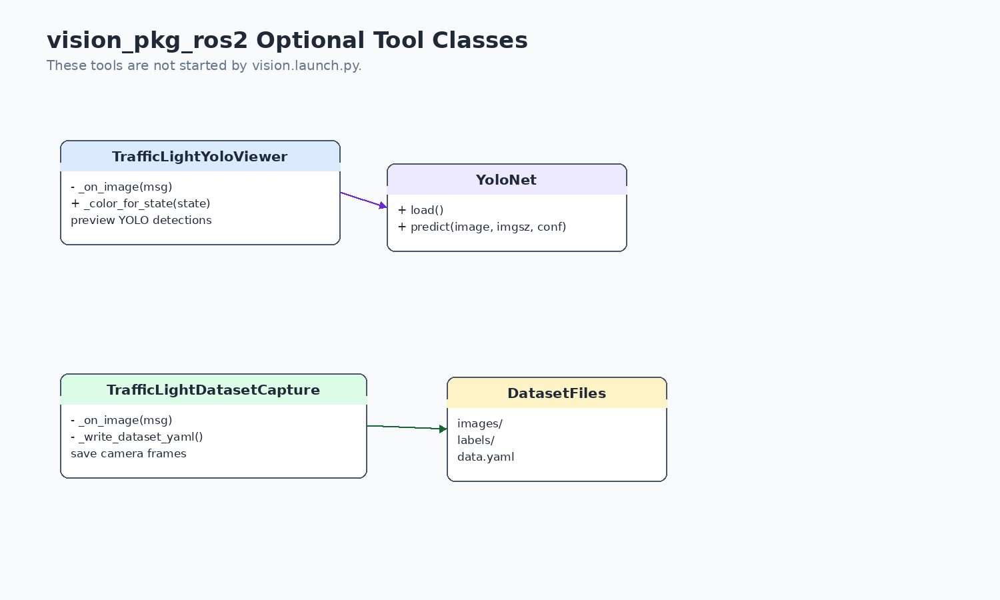

# vision_pkg_ros2 소스 코드 다이어그램

이 문서는 `vision_pkg_ros2`의 실제 Python 소스 코드 기준으로 프레임 처리 순서와
주요 클래스 의존 관계를 Mermaid Markdown으로 정리합니다.

## 1. lane_node 프레임 처리 시퀀스

## 2. 차선·정지선·스쿨존 처리 시퀀스

## 3. 신호등 처리 시퀀스

## 4. 주요 클래스 다이어그램

## 5. 선택 실행 도구

`traffic_light_yolo_viewer`와 `traffic_light_dataset_capture`는 `vision.launch.py`에서 자동 실행되지 않습니다.
필요할 때 별도 터미널에서 실행하는 보조 도구입니다.
